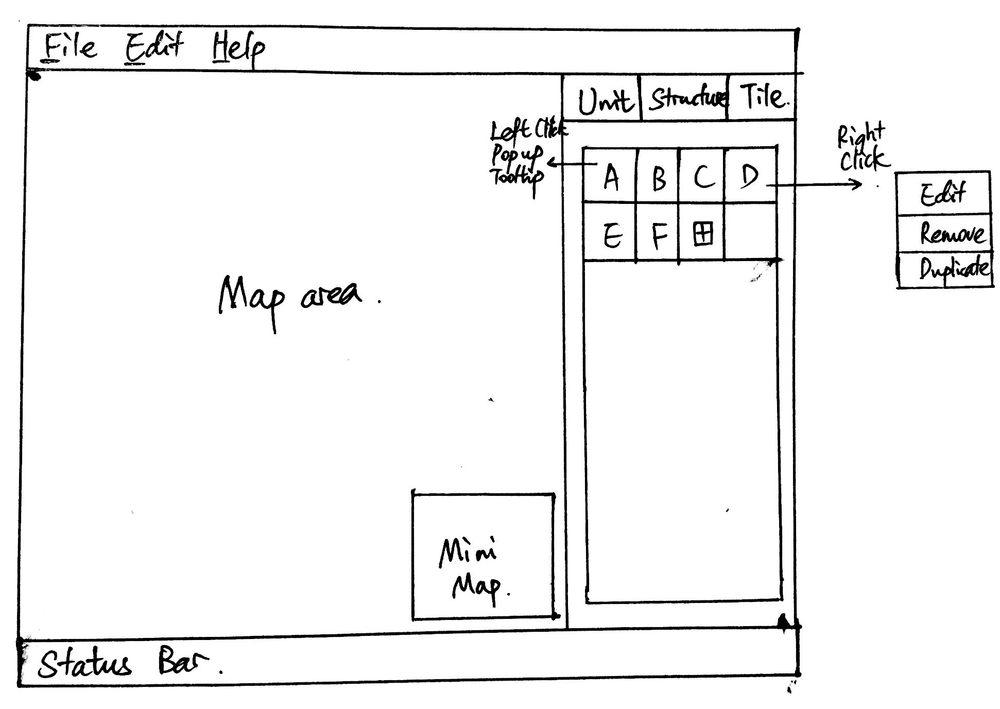
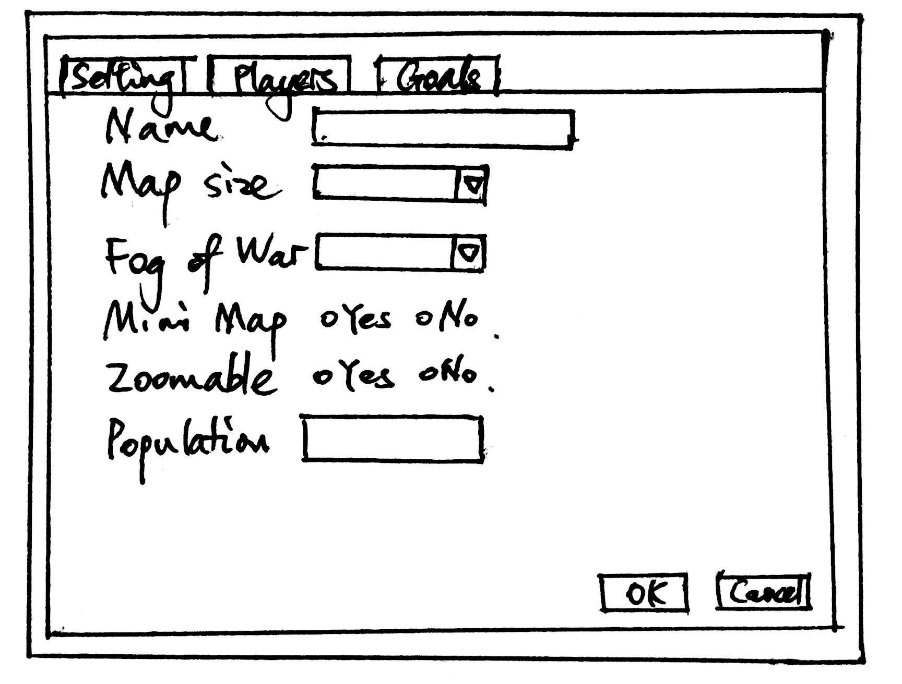
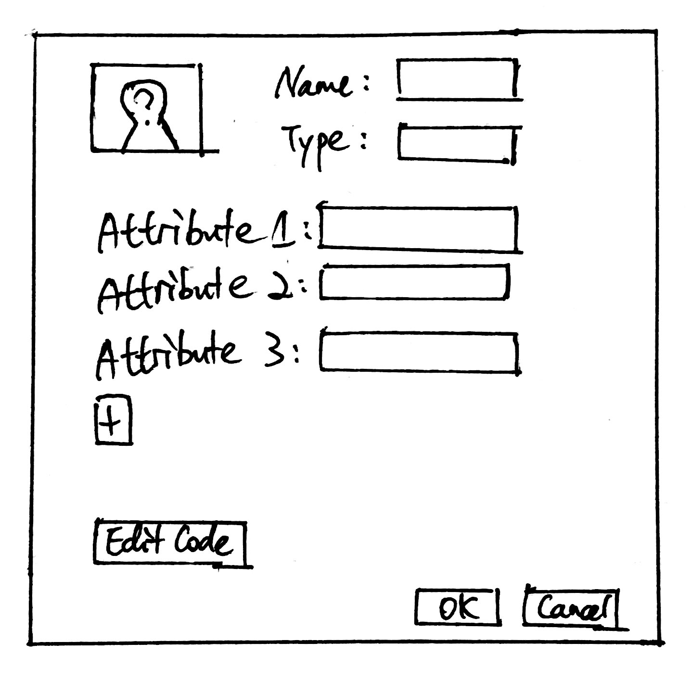
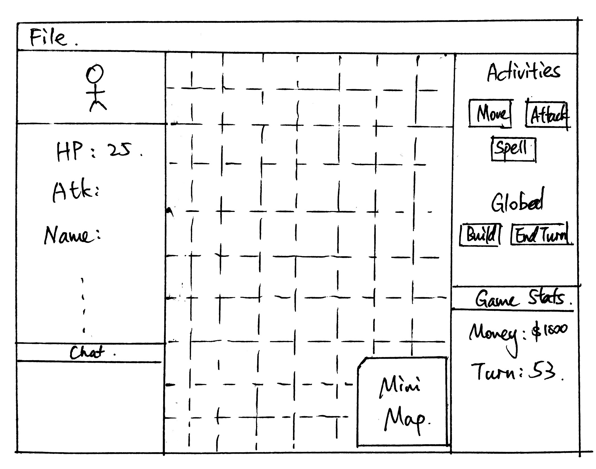
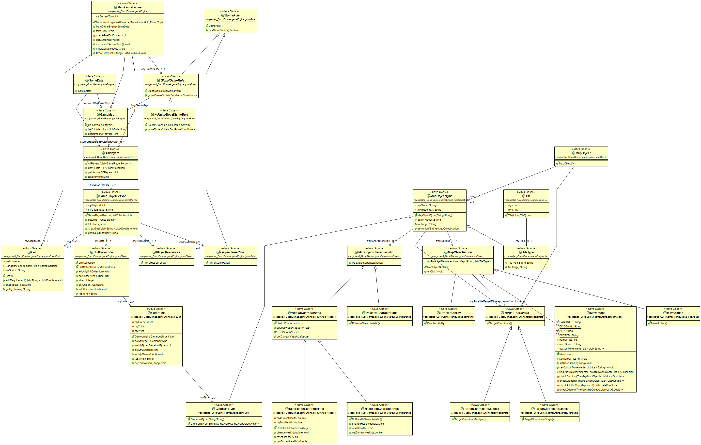
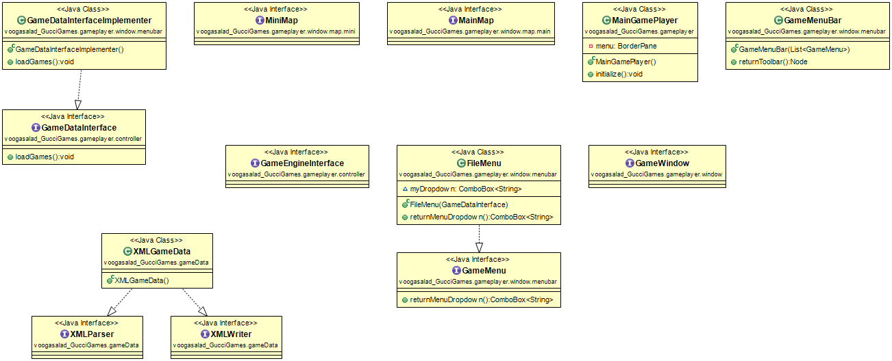

##Introduction

The purpose of VOOGASalad is to create a game engine that can implement any game of a specific genre. Our game genre is turn-based strategy.  It should be able to make games like Civilizations, Checkers, Heroes of Might and Magic, Madden Coach-Mode, etc.  In our turn based strategy, we will have each player move one at a time.  While a player is moving, the other player(s) cannot move.  At the end of a move, the game checks for a goal state (i.e. win-lose condition).  If the win-lose condition is not satisfied, then the game continues to the next players move.

Our project is broken up into a frontend and backend.  The frontend group is generally in charge of the game authoring environment and game player.  The backend group is generally in charge of the game engine and game data.  Both components will have functionality for game creating and game playing.
 
The frontend will contain the GUI which contains the different components which the user can create and play a game from.  The backend will contain the actual information of the game such as state, rules, player information, etc.   The frontend takes in information from the users; the backend processes that information.
 
In the frontend, we want to be flexible in adding new components, screens, and objects (e.g. units, structures, maps) on the UI.  Also, we will be flexible in how the user interacts with the game (i.e., click versus buttons versus controller).  In the backend, we want to be flexible in adding new rules, types of moves, winning conditions, etc.  However, we want to be inflexible with regard to certain rules of a turn based strategy game such as one player turn at a time.  Overall, we want a separation of the frontend and backend.  That is, the backend should contain no JavaFX imports and be able to work with a different front end. 

##Overview
The project was given to us already divided into the Graphical Authoring Environment (GAE), Game Engine, Game Player, and Game Data parts, and we plan to stick with these major divisions because they are well-defined, separate components of the project. We have also further divided up the most complicated part, Graphical Authoring Environment, into front and back end parts in order to separate the Authoring Environment’s view from the model.

The Game Data portion includes the shared files from which the program is loaded from and the format of saved game files and sessions. For the former we will use Java resource and media files by calling ResourceBundle.getBundle(String). The purpose of these files is to make our VOOGASalad data driven, so that the details of the program are located in one place and can be easily modified. For the latter we will create a package of classes that use write and read XML, and this will be the main way that games are saved, loaded, and played. We will also implement our cloud database utility module for this part which will allow game authors to save games to and load from an online repository. The GAE, Engine, and Player will interact with a Game Data class whenever each of them loads from .properties, media, and XML files using DOM parsing. The GAE and Player in addition will need to reference a special Game Data class that is able to write to XML using XStream's toXML() and fromXML() methods.

The Game Player portion consists mainly of the GUI to display and play a game. It should have a main window class that holds instances of different GUI components such as a map, mini map, and menu bar which calls methods on a GamePlayerController which has references to the GameEngineInterface. It communicates with the Engine through this controller to call methods such as endTurn(GamePlayerPerson), and it is able to communicate with the Authoring Environment through the XML Game Data.

The Game Engine portion describes the game logic and “back end” for any generic turn-based strategy game. For example, it defines a generic Map and MapObjects from which other essential classes such as TileType can inherit from as well as GameRules that prescribe how the game loop runs and what conditions are checked such as hasGameEnded(). The Engine holds both the back end for what the Player needs to access and display and the validator for the GAE when the author clicks on "Build". The Engine will be passed as different interfaces pertaining to requesting component. Groovy code from the GAE may create new classes in the Characteristics or Rules package.

Finally the Graphical Authoring Environment is what the game author will use to graphically create a custom turn-based strategy game. This will have its own MVC structure. The View will consist of the GAE GUI written using the JavaFX library. The Model will contain the data structures from which the GUI will pull from and add to whenever the user makes changes the game being authored. The choices for different MapObjectTypes will be stored in ObservableLists of TileTypes and the MapObjects will be stored in ObservableLists of Tiles for instance. The Model and View each have a reference to the GAEController through the ModelGAEController and GUIGAEController respectively, and the main interaction will be the View calling getList(), addToList, or deleteFromList() methods of the controller which will perform the function on the data in the Model.

For an example use case of editing the Map, the author drags and drops a tile onto the Map, the View calls the addComponent() method in the controller passing in the MapObject and a TargetCoordinate, the Model adds a new instance of the MapObject to its list, and the View observes this change in the list and updates its Map display. Another example is the author creating a custom MapObjectType, and for this the View will call the controller to ask the back end for an ObservableList of fields, the author edits those field values in the View, the View sends back a Map<String,String> through the controller to the back end along with custom Groovy code if needed, using this the back end will add a new MapObjectType to its ObservableList, and the new MapObjectType will appear in the View. The Model will have a reference to the Engine, and clicking the "Build" button will call its checkForErrors() method for Groovy code.

##User Interface
There will be two user interfaces as part of our front end: the Game Authoring Environment and the Game Player.

##Game Authoring Environment

The game authoring environment consists of a UI that communicates with the model data (also contained within the game authoring environment) to create instances of the game components, including board tiles, structures, and units. A user can create their own game environment using either the default choices, or customizing the game components. All the view components will be implemented using a BorderPane and will be designed according to a hierarchy that can be easily extendible. 

Since our game engine will follow a MVC design, each component of the view will have a corresponding model object that communicates with the game engine to determine functionality of each view component. 

The process that a user must follow to author an environment is as follows, and a visual depiction of our UI will be drawn below:
The user defines the grid size of the map/gaming environment.
The user selects or load a background image
The user will also define how many players can play each game, and initial starting parameters for each player.
The user then builds a map by dragging tiles, structures, and units to the map. These will be organized in a TabPane presented to the user. There will be three tabs, one for tile, one for structure, and one for unit. Each tab with consist of the default map object available for each category, as well as an “Add” option that will allow user to create custom map object of that type. Users may specify custom map object behaviors using groovy.
The user will specify the player each structure belong to and structure each collection of unit belongs to
Validation:
	Validation occurs after each new modification to the map. In our program, validation occurs in two steps:
Preliminary validation: For each user input, the game authoring environment (Front-End) will verify to make sure a). the input is of valid type, b). the input is complete. If both cases are satisfied, the inputs are passed to the game engine for further validation. Else, an Exception with appropriate message will be thrown.
Secondary validation: The game engine validates user modification is valid. For instance, it ensures structures are placed on appropriate tiles, no more than the maximum number of units/tiles are placed on a single tile, etc. 
After defining a game, the user can choose to run the game from the menu bar. This will save the configured game into the cloud-based utility, and then create the Game Player environment. The configured game will be loaded into the Game Player,  which contains instances of the user defined map, tiles, and units. Also, when the user clicks “run game,” this is where the game engine validates the user-defined game. If there is an error, the GUI will display a visual error message. Otherwise, the View component itself does not perform any validation functionality. 

Visual Depiction:

Figure 1: Game Authoring Environment

Figure 2: Game Settings Dialog in GAE

Figure 3: Dialog for adding new game objects (tile/unit/structure)

###II. Game Player

The Game Player front end is the user interface that display the newly created turn-based strategy game for interactive play. Characteristics of the Game Player front end are briefly described below, followed by a visual depiction:

Our Game Player environment will also feature a mini map that displays the explored, and displays the player’s current location. The game player environment will be updated simultaneously using Observer/Observables of the GUI components observing its corresponding model objects. This includes updating the player’s current HP, actions, and money.
At any point during the game, the user can decide to save the game’s current state, and later load the game beginning from the state at which it was saved at. These options will be specified in the menu bar of the Game Player environment.

Visual Depiction:

Figure 4: Game Player

##Design Details
The four main modules for VOOGASalad are:

#### Game Authoring Environment 

The game environment will enable the user to create their custom turn-based strategy game. It is divided into three components following the MVC design pattern: Model, View, and Controller. The view will be created using JavaFX Scene builder and contains three major components: Menu Bar, Tab, and Map. The Menu Bar will contain items that allow the user to save the game (upon completion), load previous games, and configure game properties. The Mapwill contain an n by n grid that users can populate by dragging and dropping elements. The Tab View will contain three individual tabs: Tile Tab, Unit Tab, and Structure Tab. Each tab contains a collection of elements and an add custom button. For instance, in the Tile Tab, each element will represent an available Tile.Each individual element in each Tab View is an instance of MapObjectType. All tabs will implement the ITab interface. Users will be able to set default game properties and create custom objects through pop-up dialog boxes. Each dialog box will may inherit the Dialog class of JavaFX. The View checks for invalid inputs, and throws InvalidInputException.

The View communicates to the Model through the Controller. When the Controller initializes the View and the Model, it passes itself as an interface to both. The view will have an instance of IGUIGaeController, and the model will have an instance of  IModelGaeController. As a result, we form a bi-directional communication channel between the front-end and the back-end. Every time the map ismodified, the GaeGUI will call addComponent() or deleteComponent(). The backend responds by sending information to the Game Engine to check for validity of the action. If the action is allowed, the change will appear on the front-end GUI, else, an Exception will be thrown.

The back end will load from .properties files, and it will utilize JavaFx’s ObservableList interface. The Engine, Player, or Data do not need to have access to the back end so the External API is currently very bare. The back end however will collaborate with the Engine by instantiating and storing a reference to a GameEngineToGAE interface so that it can call methods such as checkForCompileErrors(). Also, it will collaborate with the Data by instantiating an XMLGameData class, and the back end will pass a reference of its GameSourceData into the its writeToXML() method when a game needs to be saved as well as call readFromXML() when a game needs to be loaded. Next, some Internal API for the back end that will be used for when extensions are needed might include protected methods such as

getStateData()

addToStateData()

for when the data lists are to be accessed. The goal of the back end is to separate the game data and state from the GAE view so that the front end doesn’t need to worry about storing any information; it always loads data from and adds data to the back end. It also hides the GAE view from the other components of the project like the Engine and Data so that there is one central location in the GAE for API interactions. The essential abstraction that the back end provides to all other components is the authoring environment data (i.e. List<MapObject>) still in Java form.

	In between the GAE front and back ends there exists a GAEController that solely facilitates interactions between these two components within the GAE. This controller will instantiate the front and back ends as well as implement the IGuiGaeController interface which allows the front end to call methods such as deleteComponent() and addCustomUnitType() in the back end. The back end will communicate to the front end mostly using the Observer/Observable library, meaning that it will notify the front end of any changes to its data Lists.

Figure 5: UML Diagram for Game Authoring Environment

#### Game Engine

The game engine will contain functionality needed to both create and play a game.  The game engine is built through composition.  The game engine starts with the MainGameEngine class.  The MainGameEngine contains the global game rules and map via GlobalGameRule and GameMap class.  The GlobalGameRule are the rules which applies to all the players.  The GameMap contains the players via an AllPlayers class.  AllPlayers contains a list of GamePersonPlayer (which are all the players). Each GamePersonPlayer contains a class which contains collections of units (UnitCollection), structures (StructureCollection), and rules unqiue to the players (PlayerGameRule).  There will be a neutral player which loads the units and structures for all the players to use.  Each of the other players will contain the units and structures they built and attained.

While creating the game, the game engine will use information from a specified XML file about default maps, units, structures, etc.  While playing or loading the game, the game engine will interact with the GameData class to load previously saved games.The Game Authoring Environment and Game Player will interact with the Game Engine via interfaces.  

The Game Authoring Environment will initially get all the default settings for creating the game (i.e. default map, rules, etc.).  Then, the user will be allowed to update the creation of the game (i.e., changing preferences, adding new rules, etc.).  These changes will be relayed back to the Game Engine via methods in an interface.  The Game Engine will check to see if the changes are valid and throw exceptions if necessary.  The Game Engine will interact with the Game Player through a different interface.  This other interface will contain execute methods which the Game Player will use when a player moves.  These execute methods will allow the Game Engine to update the state of the players and check the goal condition.
	
The Game Engine will contain default game settings when creating a game.  However, in terms of extensibility, the user be able to write Groovy code which will be parsed by the backend to modify the gameplay.  The user will have access to a set of variables (predefined by the Game Engine) which they can modify through Groovy code.  The user will be able to define how these variables change when an event occurs. 

Figure 6: UML Diagram for Game Engine

#### Game Player
	
The Game Player portion consists mainly of the GUI to display and play a game. When a Game Player is initialized, It should initialize a class which implements GameWindow. Within this GameWindow, there will be a GameMenuBar component, which will have classes implementing a GameMenu interface. The special thing about a GameMenu is that it comes with a dropdown (ComboBox) which allows easy construction of a menu toolbar when multiple GameMenus are combined. Once the user loads data, there will be other components introduced within GameWindow, such as MiniMap and different GameMenu dropdowns. Note that to load the game, GameWindow will need to relay access to the GameEngineToActualGame interface to different components (to intialize the MainGameEngine from SomeData, to make sure that all tiles can be acquired from the MainGameEngine, to make sure that different actions can be performed within ) . have a main window class that holds instances of different GUI components such as a map, mini map, and menu bar which calls methods on a GamePlayerController which has references to the GameEngineInterface. It communicates with the Engine through this controller to call methods such as endTurn(GamePlayerPerson), and it is able to communicate with the Authoring Environment through the XML Game Data. 

Figure 7: UML Diagram for Game Player combined with classes for Game Data

#### Game Data

The Game Data module holds, edits, and passes data between the Game Player and Game Engine. It will contain information in two formats: XML and properties files. Properties files will be used mainly in the front end for loading game settings. XML will be used in the backend for creating, saving, and editing new game settings and variables. A Parser class implementing XStream will be used to read in and edit XML data. The data files will include all variables and information pertaining to game creations. These variables include, but are not limited to, high score values which will not be loaded, but will be saved into a cloud-based module that updates whenever a higher score is achieved. Further variables include number and types of tiles and units allowed for the specified game, number of players and characteristics of the players including, but not limited to, default characteristics such as health points, rules of the game including global game rules that apply to each player, and individual game rules which applies only to specific players (think BANG! where each player has a different win condition), and end game conditions (how players win, lose, or cause a draw). As part of the Game Data, there will be a cloud database utility module that will hold data for a game outside of when the game is being played so players can compare results from different instances of a game.
	
Other modules will be able to access the data files and extract information from them using the Parser class (if needed) to read and write to XML in the backend, and Resource Bundles to read from properties files in the front end. 
The Game Data module should not be extended to have any other functionality that does not deal with editing, saving, and loading data.

The Game Data module is necessary in order to allow for ease of access in creating new games and saving and passing around game states. It allows users to save progress in games, and resume at a later date, or play different games using the same game engine. It also allows for custom creation of game settings.  

An example of saving and loading via xstream is given in: ./examples/XStreamExample/XStreamGameEngine.
	
##Example Games

Describe three example games from your genre in detail that differ significantly. Clearly identify how the functional differences in these games is supported by your design and enabled by your authoring environment. Use these examples to help make concrete the abstractions in your design. This section may be as long as it needs to be and go into as much detail as necessary to cover all your team wants to say.

Chess, Civ 4, Heroes of Might and Magic, Bang, Monopoly, Poker, Madden Coach Mode

There are two main assumptions we are making in terms of a turn-based strategy: It is composed of turns, and it is played on a grid. As such, our engine will not support certain turn-based strategy games (such as those involving cards like Avalon and Bang) but we have used ideas from multitude of games to make sure our design is flexible enough.

Civilization 4 is a main game in our genre that shaped most of our design. It has units, structures and tiles and different units, structures and tiles have different abilities. To account for Civ, we have constructed the idea of a global rule, where every player strives for the same goal, which is checked inside the MainGameEngine.java class. This is how we got the idea of placing units onto the Map as well. We have also created a Tile subclass from a MapObject class, since different tiles carry different important bonuses in Civ 4. Also, some units (such as a Worker) do not have health and combat abilities and thus gave us the idea that perhaps health is not an essential component of a GameUnit. Also, we realized that different units have different abilities which can change over time.In terms of the authoring environment, we allow for custom creation of everything on a Map (structures, units and tiles), though we have not included auxillary -but important- parts of Civ (such as technology) yet. However, we will keep our design flexible enough to -hopefully- offer native support to technology trees. Additionally, it introduced us to the concept of PlayerResource and a CostCharacteristic to different MapObjectTypes, Comparing Civ 4 to Civ 5, we considered having a single unit and having multiple units on the same tile, though we are debating on design advantages. Another thing which Civ pushed us to was to enable multiple GlobalRules at the same time. 

Heroes of Might and Magic on the other hand introduced us to the complexity of different units. While micromanagement is not as extreme as it is in Civ, different units have totally different abilities. However, one concrete thing was that even though it isn’t visible from the graphics, units still move in tiles. This game did not stretch our design that much, it just helped establish concepts from Civ. It allowed us to consider the idea of having different levels within a game, with each different level having a different goal. For the Game Authoring Environment for both games, we allow inputs of levels and rules through toolbars on the top with enabling user to input custom Groovy code.   

One game which introduced different ideas was Bang. One fundamental idea that this game had is the idea of player-specific goals. Different players can have different goals to achieve in a game after all. This introduced the concept of PlayerGameRules in addition to GlobalGameRules. Even though one fundamental assumption we made is the use of grids, the users can all place their units (cards) on a grid and we can hide every players’ cards in fog of war, thus simulating a card game. After all, even though a grid seems perhaps a rigid thing to assume, every game takes place on a stage and grid is just one actualization of it. 

Besides these three games, we have considered different games like Madden, though we have focused our attention on building a very flexible Civ-like game for the demo.
	
##Design considerations

One of the design consideration that we have discussed back and forth between our subteams is distinction between different types of objects in our game. We originally had a distinction between tiles, units, and structures that could be added to the game. However, there was not a clear distinction in the functionality differences between units and structures so we merged structures into the unit type to prevent any unnecessary repeating of code. It is possible as our design continues to develop that we might again create a distinction between structures and units if distinct functionality becomes apparent. 

Another design consideration we will continue to discuss in the game authoring environment is how map objects will be added to our model. We currently have our design configured such that the a map object is created in the front end whenever a user adds a tile type or unit type to the map in the GUI. This map object is passed through the controller to the model where it is saved. Depending on what type of information is stored in the map object, it is likely we might find that it would be more practical for the front end to send information regarding the tile or unit type and where it was placed on the map to the backend. The backend will then package this information as a map object itself and save it in the model. This could create a clearer division of tasks in the relationship between the user interface and the back end of the authoring environment.

##Team Responsibilities 	

We have divided the team up into 2 main groups so far:

Game authoring environment: Karen, Ying, Mike, Daniel, John, 
Game engine: Efe, Sally, Joy, Tina

Additionally, Ted will do a utility for the whole class to use and then code a basic GamePlayer. For the Game Engine, our goal is to finish up the engine by Sunday 15th to help the Game Authoring Environment before the demo day. Right after the demo, we will discuss possible extensions and redistribute people between groups.
